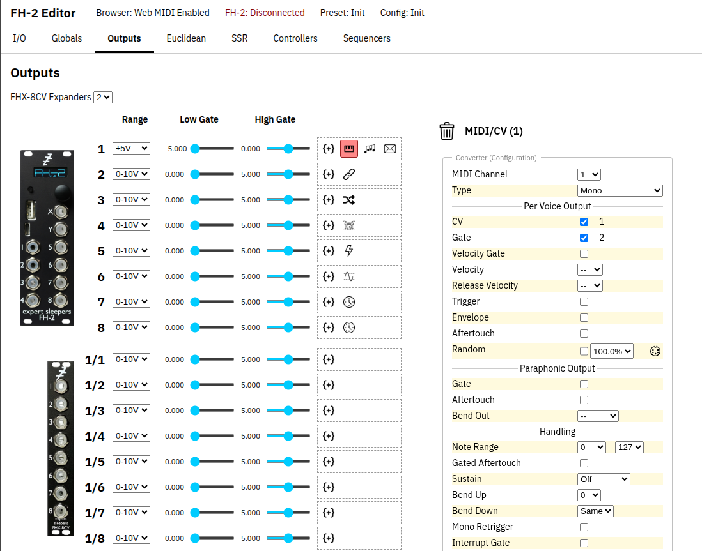

# FH2Edit

A quick start editor for the Expert Sleepers FH-2.

To use, no installation is required. Simply open [FH2Edit](https://raw.githack.com/spgarbet/FH2Edit/main/FH2Edit.html) in Chrome or Opera and attach the FH-2 to your computer via USB. 

This is a simple (but incomplete!) combined preset/configuration editor for the FH-2. It focuses on an output-centric viewpoint. It shows one narrow set of concerns at a time, with tooltips built in. [Expert Sleepers](https://www.expert-sleepers.co.uk/) provided [open-source editors](https://github.com/expertsleepersltd/FH-2_tools) for their [FH-2](https://www.expert-sleepers.co.uk/fh2.html). The stock editors, while complete, can be overwhelming for a beginner and this editor is a focused set view exposing to the user what is affecting the output of a port. This editor hides most of the distinction between presets and configuration from the user. Consider this editor the "quick start" but not suitable for advanced work.

This project is complementary to the official editors and does not change the need for their officially provided ones. This effort would not exist without Expert Sleepers openly sharing their tools, code, and sysex specification. Much gratitude for their community support.

This editor will likely never support every possible feature the FH-2 offers, however it aims to hit most common features by the simplest means possible. 

## Community Guidelines

This is an open-source project and encourages participation. There are several ways to make this better and useful. Discussion and issue is public on [GitHub](https://github.com/spgarbet/FH2Edit/issues).

- Reporting bugs: It is incredibly helpful to know if something isn't working as it should. 
- Sharing improvement ideas: Is there some way in your common workflow that could be done with less friction?
- Pull Requests: Encouraged, but before putting the effort in start a discussion as an improvement idea above.
- Seek Support: Just ask questions. Understanding what is confusing for someone leads to improvement as well. The insights to make the interface more intuitive come from such discussions.

## Status

FH2Edit is under active development.

**Supported**

- **Connection:** MIDI port selection, reading and writing SysEx to the FH-2
  or to a file, reading the FH-2 screen, and flashing.
- **Global settings:** preset and configuration settings, the eight global
  channel/CC mappings (start/stop and similar), and CV/MIDI X/Y.
- **Output assignments:**
  - Clock
  - LFO with visual feedback
  - MIDI to CV
  - Shift registers
  - Euclidean patterns
  - Envelope
  - Arpeggiator
  - Trigger editor

**In progress**

**Planned**

- MIDI mapping learn mode
- Tunings (32 slots, Scala/keyboard)
- HID gamepad and HID keyboard outputs
- A Gates tab (for things like expanders)

**Not planned**

Use the official editors for these features.

- Novation Pad interface
- Sequencer editing

## Aftermatter

This is not an official product of Expert Sleepers, nor is affliated in any way. They maintain trademark and copyright over all their materials, and no infringing claim is made in the licensing of this software.

Back up configurations and presets before using this editor.

FH2Edit is not rated for submarine, space, or microwave operation. We strongly advise against use while showering. In rare cases, it may trigger existential dread and recursive anxiety loops. Do not taunt FH2Edit—taunting voids our non-existent warranty and leads to vacuous sanity implosion. It absorbs 99% of excess reality if exposed to pangolins.

FH2Edit An Expert Sleepers Configuration/Preset Edit Tool
Copyright (C) 2026 Shawn Garbett

This program is free software: you can redistribute it and/or modify it under the terms of the GNU General Public License as published by the Free Software Foundation, either version 3 of the License, or (at your option) any later version.

This program is distributed in the hope that it will be useful, but WITHOUT ANY WARRANTY; without even the implied warranty of MERCHANTABILITY or FITNESS FOR A PARTICULAR PURPOSE.  See the GNU General Public License for more details.

You should have received a copy of the GNU General Public License along with this program.  If not, see [https://www.gnu.org/licenses](https://www.gnu.org/licenses).
